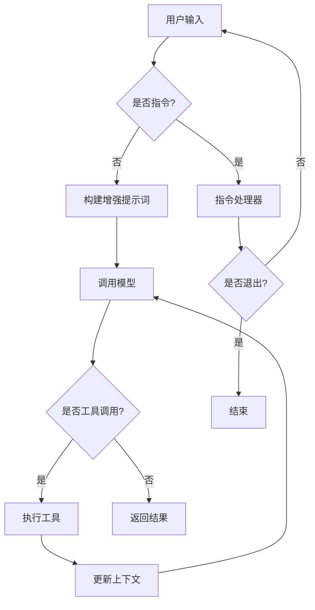

# 代码智能体 Spec 文档

## 1. 功能概述

代码智能体是一个基于大语言模型的自动化编程助手，能够理解用户的自然语言请求，通过调用工具完成代码生成、文件操作、命令执行等任务。

### 核心能力
- **代码生成与修改**：根据需求生成或修改代码
- **文件操作**：读取、写入、编辑文件
- **终端命令执行**：执行系统命令
- **内容搜索**：搜索文件内容和文件名
- **网络搜索**：获取外部信息
- **RAG 检索**：检索项目上下文信息
- **Hook 扩展**：支持在关键节点注入自定义逻辑
- **LSP 集成**：支持语言服务器协议，提供代码补全和分析能力

---

## 2. 架构设计

### 2.1 模块划分

| 模块         | 职责                         | 文件路径                     |
| ------------ | ---------------------------- | ---------------------------- |
| **Agent**    | 核心协调器，管理任务执行流程 | `src/code_agent/agent.py`    |
| **Config**   | 配置管理                     | `src/code_agent/config.py`   |
| **Context**  | 上下文管理（用户/项目/会话） | `src/code_agent/context.py`  |
| **Memory**   | 记忆管理（合并上下文）       | `src/code_agent/memory.py`   |
| **Tools**    | 工具实现与管理               | `src/code_agent/tools/`      |
| **Commands** | 指令处理                     | `src/code_agent/commands.py` |
| **Hooks**    | Hook 系统                    | `src/code_agent/hooks/`      |
| **LSP**      | 语言服务器协议支持           | `src/code_agent/lsp/`        |
| **Main**     | 入口与交互循环               | `src/code_agent/main.py`     |

### 2.2 核心流程图

```
用户输入 → 指令判断 → 工具调用 → 结果返回
    │              │            │
    └── 模型对话 ──┴── ReAct循环┘
```

---

## 3. 用户请求处理流程

### 3.1 整体流程



### 3.2 详细步骤

1. **输入接收**：`main.py` 接收用户输入
2. **指令判断**：检查是否以 `/` 开头
3. **指令处理**：`CommandHandler` 处理内置指令
4. **提示词构建**：整合用户/项目/会话上下文
5. **模型调用**：发送请求到 LLM
6. **响应解析**：提取工具调用或直接结果
7. **工具执行**：调用对应工具并获取结果
8. **循环判断**：根据结果决定是否继续 ReAct 循环
9. **结果返回**：输出最终结果给用户

---

## 4. 记忆与上下文管理

### 4.1 记忆系统

| 类型           | 作用               | 生命周期     | 存储位置                     |
| -------------- | ------------------ | ------------ | ---------------------------- |
| **记忆**       | 合并用户和项目信息 | 跨会话持久化 | `.memo/memory.md`            |
| **会话**       | 记录当前对话历史   | 会话内有效   | `.memo/sessions/xxx.json`    |

### 4.2 记忆管理器接口

```python
class MemoryManager:
    def get_summary() -> str:
        """获取记忆摘要"""
    
    def update_user_info(key: str, value: str) -> None:
        """更新用户信息"""
    
    def update_project_info(key: str, value: str) -> None:
        """更新项目信息"""
    
    def add_history(item: str) -> None:
        """添加历史记录"""
    
    def save_memory() -> None:
        """保存记忆"""
```

### 4.3 会话管理器接口

```python
class SessionManager:
    def create_session() -> str:
        """创建新会话"""
    
    def load_session(session_id: str) -> bool:
        """加载指定会话"""
    
    def load_last_session() -> bool:
        """加载上次会话"""
    
    def save_session() -> None:
        """保存当前会话"""
    
    def add_message(role: str, content: str) -> None:
        """添加消息到会话"""
    
    def get_session_list() -> list:
        """获取所有会话列表"""
    
    def delete_session(session_id: str) -> bool:
        """删除指定会话"""
```

---

## 5. 工具系统

### 5.1 工具列表

| 工具名称         | 功能描述             | 参数                                | 返回值        |
| ---------------- | -------------------- | ----------------------------------- | ------------- |
| `write_file`     | 写入新文件           | `file_path`, `content`              | 成功/失败状态 |
| `read_file`      | 读取文件内容         | `file_path`                         | 文件内容      |
| `edit_file`      | 编辑文件（替换文本） | `file_path`, `old_text`, `new_text` | 成功/失败状态 |
| `run_bash`       | 执行终端命令         | `command`                           | 命令输出      |
| `search_files`   | 按文件名模式搜索     | `pattern`, `base_dir`               | 文件路径列表  |
| `search_content` | 按内容搜索文件       | `query`, `base_dir`                 | 匹配结果      |
| `search_web`     | 网络搜索             | `query`                             | 搜索结果      |
| `search_rag`     | RAG 检索             | `query`                             | 检索结果      |
| `sub_agent`      | 子代理任务           | `task`, `context`, `max_cycles`     | 子任务结果    |

### 5.2 工具注册机制

```python
# 使用装饰器自动注册
@ToolManager.register_tool
class WriteTool(BaseTool):
    name = "write_file"
    description = "写入文件"
    
    def parameters(self):
        return {"file_path": {"type": "string"}, "content": {"type": "string"}}
    
    def run(self, **kwargs):
        # 执行逻辑
```

### 5.3 工具调用流程

1. 模型返回 `<tool_call>{"name": "...", "parameters": {...}}</tool_call>`
2. `_extract_tool_calls()` 解析 XML 标签
3. 根据 `name` 查找工具实例
4. 调用工具的 `run()` 方法
5. 将结果加入对话历史，继续循环

---

## 6. Hook 系统

### 6.1 Hook 概述

Hook 系统允许在代码智能体的关键执行节点注入自定义逻辑，实现扩展和定制化。

### 6.2 Hook 类型

| Hook 名称               | 触发时机                     | 作用                                  |
| ------------------------ | ---------------------------- | ------------------------------------- |
| `on_agent_start`         | Agent 初始化完成后           | 执行初始化后处理逻辑                  |
| `on_task_start`          | 任务开始执行前               | 修改任务参数或进行前置检查            |
| `on_tool_call_before`    | 工具调用前                   | 修改工具参数或记录调用信息            |
| `on_tool_call_after`     | 工具调用后                   | 处理工具返回结果或记录日志            |
| `on_task_complete`       | 任务执行完成后               | 执行任务后处理或发送通知              |
| `on_agent_shutdown`      | Agent 关闭前                 | 执行清理逻辑或保存状态                |
| `on_message_received`    | 收到用户消息后               | 预处理消息或进行权限检查              |
| `on_message_sent`        | 发送响应给用户前             | 修改响应内容或记录日志                |

### 6.3 Hook 注册机制

```python
class HookManager:
    @classmethod
    def register_hook(cls, hook_name: str, handler: Callable) -> None:
        """注册 Hook 处理器"""
    
    @classmethod
    def unregister_hook(cls, hook_name: str, handler: Callable) -> None:
        """注销 Hook 处理器"""
    
    @classmethod
    def trigger_hook(cls, hook_name: str, **kwargs) -> list:
        """触发指定 Hook，返回所有处理器的返回值"""
```

### 6.4 Hook 使用示例

```python
# 注册 Hook
@HookManager.register_hook("on_task_start")
def log_task_start(task: str):
    print(f"任务开始: {task}")

@HookManager.register_hook("on_tool_call_after")
def log_tool_result(tool_name: str, result: dict):
    print(f"工具 {tool_name} 执行完成")
```

### 6.5 Hook 执行顺序

1. 按照注册顺序执行
2. 支持通过 `priority` 参数指定执行顺序
3. 支持 `stop_propagation` 终止后续 Hook 执行

---

## 7. LSP 支持

### 7.1 LSP 概述

LSP（Language Server Protocol）支持让代码智能体能够作为语言服务器运行，提供代码补全、定义跳转、代码分析等 IDE 级别的功能。

### 7.2 LSP 功能列表

| 功能           | 描述                                  | 对应 LSP 方法       |
| -------------- | ------------------------------------- | ------------------- |
| **代码补全**   | 根据上下文提供代码建议                | `textDocument/completion` |
| **定义跳转**   | 跳转到符号定义位置                    | `textDocument/definition` |
| **符号引用**   | 查找符号的所有引用                    | `textDocument/references` |
| **代码诊断**   | 分析代码错误和警告                    | `textDocument/publishDiagnostics` |
| **代码格式化** | 格式化代码                            | `textDocument/formatting` |
| **符号高亮**   | 高亮显示文档中的符号                  | `textDocument/documentHighlight` |
| **文档符号**   | 获取文档中的符号列表                  | `textDocument/documentSymbol` |
| **悬停提示**   | 鼠标悬停时显示符号信息                | `textDocument/hover` |

### 7.3 LSP 架构

```
┌─────────────────────────────────────────────────────────────┐
│                        LSP Server                          │
├─────────────────────────────────────────────────────────────┤
│  ┌──────────────┐  ┌──────────────┐  ┌──────────────┐    │
│  │  Protocol    │  │  Code Agent  │  │  Tool System │    │
│  │   Handler    │  │              │  │              │    │
│  └──────┬───────┘  └──────┬───────┘  └──────┬───────┘    │
│         │                 │                 │              │
│         └─────────────────┼─────────────────┘              │
│                           ▼                               │
│                  ┌──────────────┐                         │
│                  │   LLM Model   │                         │
│                  └──────────────┘                         │
└─────────────────────────────────────────────────────────────┘
```

### 7.4 LSP 服务器接口

```python
class LspServer:
    def __init__(self, agent: CodeAgent):
        """初始化 LSP 服务器"""
    
    def start(self, host: str = "127.0.0.1", port: int = 8080) -> None:
        """启动 LSP 服务器"""
    
    def stop(self) -> None:
        """停止 LSP 服务器"""
    
    def handle_request(self, request: dict) -> dict:
        """处理 LSP 请求"""
```

### 7.5 LSP 配置

| 配置项               | 默认值 | 说明                     |
| -------------------- | ------ | ------------------------ |
| `lsp_enabled`       | false  | 是否启用 LSP 服务        |
| `lsp_host`          | 127.0.0.1 | LSP 服务监听地址      |
| `lsp_port`          | 8080   | LSP 服务监听端口         |
| `lsp_log_level`     | info   | LSP 日志级别             |

### 7.6 LSP 客户端集成

```bash
# VS Code settings.json 配置示例
{
    "codeAgent.lsp.enabled": true,
    "codeAgent.lsp.serverPath": "python",
    "codeAgent.lsp.serverArgs": ["-m", "code_agent.lsp"]
}
```

---

## 8. ReAct 循环机制

### 8.1 循环流程

```python
def execute_task(task):
    messages = build_react_messages(task)
    
    for cycle in range(config.react_max_cycles):
        response = call_model(messages)
        result, updated_messages = process_response(response, messages)
        
        if result:  # 有最终结果
            return result
        
        messages = updated_messages  # 继续循环
    
    return "执行超时"
```

### 8.2 配置参数

| 参数               | 默认值 | 说明         |
| ------------------ | ------ | ------------ |
| `react_max_cycles` | 100    | 最大循环次数 |

---

## 9. 配置系统

### 9.1 配置项

```python
@dataclass
class Config:
    # 基础配置
    base_dir: str = "."
    
    # 工具配置
    enabled_tools: list[str] = ["write_file", "read_file", ...]
    
    # 循环配置
    react_max_cycles: int = 100
    
    # 记忆配置
    memory_file: str = ".memo/memory.md"
    sessions_dir: str = ".memo/sessions"
    
    # LSP 配置
    lsp_enabled: bool = False
    lsp_host: str = "127.0.0.1"
    lsp_port: int = 8080
```

### 9.2 工具启用机制

通过 `config.enabled_tools` 控制启用的工具，未在列表中的工具不会被加载。

---

## 10. Benchmark 方案

### 10.1 测试场景

| 场景       | 测试目标             | 输入示例                 |
| ---------- | -------------------- | ------------------------ |
| 代码生成   | 生成正确可运行的代码 | "写一个快速排序算法"     |
| 文件操作   | 正确读写文件         | "创建一个 README.md"     |
| 命令执行   | 正确执行系统命令     | "列出当前目录"           |
| 多步骤任务 | 完成复杂任务         | "分析项目结构并生成文档" |
| 上下文理解 | 理解历史对话         | "继续优化刚才的代码"     |
| Hook 扩展  | 正确触发 Hook        | 注册 Hook 并验证触发     |
| LSP 功能   | 正确响应 LSP 请求    | 代码补全、定义跳转等     |

### 10.2 评估指标

| 指标               | 计算方式                    |
| ------------------ | --------------------------- |
| **任务完成率**     | 成功完成的任务数 / 总任务数 |
| **代码正确性**     | 生成代码通过测试的比例      |
| **工具调用准确率** | 正确选择工具的比例          |
| **循环效率**       | 完成任务的平均循环次数      |
| **响应时间**       | 平均任务执行时间            |
| **Hook 覆盖率**    | 触发的 Hook 数量 / 注册数   |
| **LSP 响应时间**   | LSP 请求平均响应时间        |

### 10.3 测试执行

```bash
# 运行基准测试
python -m pytest tests/benchmark/

# 生成报告
python -m pytest tests/benchmark/ --report=benchmark_report.json
```

---

## 11. 安全机制

### 11.1 安全检查

- **命令白名单**：限制可执行的命令
- **路径限制**：限制文件操作范围
- **敏感信息过滤**：屏蔽 API key 等敏感内容
- **资源限制**：限制命令执行时间和输出大小

### 11.2 错误处理

```python
class SecurityManager:
    def check_task(task: str) -> bool:
        """检查任务安全性"""
    
    def check_command(command: str) -> bool:
        """检查命令安全性"""
```

---

## 12. 扩展机制

### 12.1 添加新工具

1. 在 `src/code_agent/tools/` 新建工具文件
2. 继承 `BaseTool` 类
3. 使用 `@ToolManager.register_tool` 装饰器
4. 在配置中添加工具名称

### 12.2 添加新指令

```python
command_handler.register_command(
    "/custom_cmd", 
    handler_func, 
    "指令描述"
)
```

### 12.3 添加新 Hook

```python
@HookManager.register_hook("hook_name")
def custom_hook(**kwargs):
    # 自定义逻辑
```

---

## 13. 部署与运行

### 13.1 环境要求

- Python 3.13+
- OpenAI API Key（或兼容 API）
- 依赖：`openai`, `uv`, `pygls`（LSP 支持）等

### 13.2 启动命令

```bash
# 开发模式
uv run dev --platform bailian --model qwen-plus

# 生产模式
python src/code_agent/main.py --platform bailian --model qwen-plus

# 启动 LSP 服务
python -m code_agent.lsp --host 127.0.0.1 --port 8080
```

---

## 14. 日志与监控

### 14.1 日志记录

- 任务执行日志
- 工具调用日志
- Hook 触发日志
- LSP 请求日志
- 错误日志
- 性能指标

### 14.2 监控指标

- 任务执行成功率
- 平均响应时间
- 工具调用频率
- Hook 触发次数
- LSP 请求数量
- 错误类型分布

---

## 附录：数据结构

### 工具调用格式

```xml
<tool_call>
{"name": "工具名称", "parameters": {"参数名": "参数值"}}
</tool_call>
```

### 响应格式

```
1. **思考**：分析任务，决定下一步行动
2. **行动**：<tool_call>{"name": "...", "parameters": {...}}</tool_call>
3. **观察**：工具执行结果
4. **结论**：任务完成总结
```

### Hook 配置示例

```json
{
    "hooks": {
        "on_task_start": ["logging_hook", "validation_hook"],
        "on_tool_call_after": ["analytics_hook"]
    }
}
```
